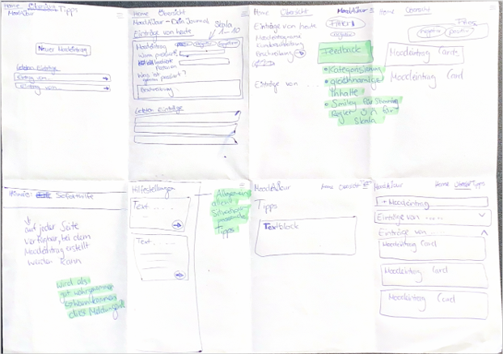
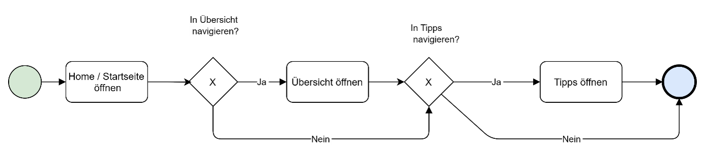
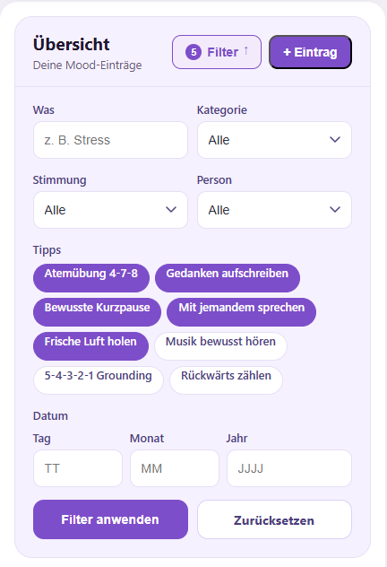

# Projektdokumentation - MoodAJour

## Inhaltsverzeichnis

1. [Ausgangslage](#1-ausgangslage)
2. [Lösungsidee](#2-lösungsidee)
3. [Vorgehen & Artefakte](#3-vorgehen--artefakte)
    1. [Understand & Define](#31-understand--define)
    2. [Sketch](#32-sketch)
    3. [Decide](#33-decide)
    4. [Prototype](#34-prototype)
    5. [Validate](#35-validate)
4. [Erweiterungen [Optional]](#4-erweiterungen-optional)
5. [Projektorganisation [Optional]](#5-projektorganisation-optional)
6. [KI-Deklaration](#6-ki-deklaration)
7. [Anhang [Optional]](#7-anhang-optional)

## 1. Ausgangslage
Studierende und junge Berufstätige reagieren im Alltag häufig emotional auf belastende Situationen wie Stress, Zeitdruck oder zwischenmenschliche Konflikte. Diese Reaktionen werden jedoch selten festgehalten und können im Nachhinein kaum eingeordnet oder reflektiert werden. Bestehende digitale Lösungen sind in solchen Momenten oft zu komplex und zeitintensiv, weshalb sie im Alltag kaum konsequent genutzt werden.

- **Problem:** Es fehlt eine einfache und schnelle Möglichkeit, emotionale Trigger im Moment festzuhalten, sodass wiederkehrende Muster sichtbar werden und die Selbstreflexion unterstützt wird. Beispiel: Jemand wird in einer Prüfungswoche wiederholt von Versagensangst überwältigt, bemerkt dieses Muster aber nicht, weil die Momente nicht festgehalten wurden.
- **Ziele:**
  - Emotionale Reaktionen schnell und ohne Aufwand erfassen
  - Eigene Gefühle und Auslöser (Trigger) besser verstehen
  - Wiederkehrende Muster im emotionalen Erleben sichtbar machen
  - Selbstreflexion auch bei Zeitdruck zugänglich gestalten
- **Primäre Zielgruppe:** Studierende sowie junge Berufstätige im Alter von ca. 18–35 Jahren, die unter hohem Leistungs- und Zeitdruck stehen und ihre emotionalen Reaktionen besser verstehen möchten.  

## 2. Lösungsidee
MoodAJour ist eine mobile App zur schnellen Erfassung und Reflexion von emotionalen Situationen im Alltag. Die App ist in drei Hauptbereiche gegliedert: **Home**, **Übersicht** und **Tipps**. Diese Struktur entstand in der Crazy-8-Übung und wurde durch Peer-Feedback bestätigt.

- **Home:** Direkter Einstieg zur Erfassung eines neuen Moodeintrags. Die Eingabe ist bewusst einfach und reduziert gestaltet, ergänzt durch die Anzeige der zuletzt erfassten Einträge.
- **Übersicht:** Strukturierte Darstellung aller Einträge mit Funktionen zum Filtern, Bearbeiten und Löschen sowie einer Detailansicht je Eintrag.
- **Tipps:** Reflexionsimpulse, ein kurzer Disclaimer sowie ein Hinweis zur Soforthilfe bei belastenden Situationen.

Die Navigation erfolgt über eine Top Navigation Bar, die jederzeit erreichbar ist. Auf Unterseiten (z.B. Detailansicht eines Eintrags) kommen prozessbezogene Schritte zum Einsatz, um die Nutzenden strukturiert durch den jeweiligen Ablauf zu führen.

**Kernfunktionalität (Workflows):**
1. **Neuer Moodeintrag & Warnhinweis:** Erfassung eines Eintrags mit Stimmungsskala (1-10), Emojis und weiteren Angaben; bei belastenden Werten wird ein Warnhinweis angezeigt.
2. **Mood-Einträge verwalten (Übersicht & Detail):** Alle Einträge auf einen Blick, filterbar nach Kategorie; Öffnen der Detailansicht, Bearbeiten und Löschen einzelner Einträge.
3. **Navigation zwischen Home, Übersicht und Tipps:** Schneller Wechsel zwischen den drei Hauptbereichen über die Top Navigation Bar.

- **Annahmen:** Eine reduzierte, mobile Eingabe erhöht die Wahrscheinlichkeit, dass Einträge direkt nach einer Situation erfasst werden. Die Sichtbarkeit von Mustern über die Übersicht fördert die Selbstreflexion der Nutzenden.
- **Abgrenzung:** Die App ist bewusst als mobile Anwendung konzipiert. Eine Desktop-Version ist nicht Teil des Umfangs. Komplexe Analyse- oder Auswertungsfunktionen (z.B. Diagramme, Statistiken) sind ebenfalls nicht enthalten.

## 3. Vorgehen & Artefakte

### 3.1 Understand & Define
- **Zielgruppenverständnis:** Die Zielgruppe umfasst Studierende sowie junge Berufstätige im Alter von ca. 18 bis 35 Jahren, die unter hohem Leistungs- und Zeitdruck stehen. Die Problemraumanalyse zeigte, dass emotionale Reaktionen auf belastende Situationen wie Stress, Zeitdruck oder Konflikte im Alltag zwar häufig auftreten, aber selten systematisch festgehalten werden. Bestehende Apps wurden als zu komplex und zeitaufwendig bewertet, sodass sie im Alltag kaum konsequent genutzt werden.

  - **Recherche:** Die Erkenntnisse über die Zielgruppe wurden durch eigene Beobachtungen im Studienumfeld, informelle Gespräche mit Kommilitoninnen und Kommilitonen sowie einen Vergleich bestehender Mood-Tracking-Apps (z.B. Daylio, Reflectly) gewonnen. Dabei zeigte sich, dass der Alltag der Zielgruppe wenig Raum für aufwendige Reflexion lässt und einfache, schnelle Lösungen bevorzugt werden.

  - **Proto-Persona:**
    - **Name:** Lena, 23 Jahre
    - **Situation:** Studentin im 4. Semester, wohnt in einer WG, pendelt täglich zur Hochschule. Neben dem Studium arbeitet sie 60% in einem Büro.
    - **Ziele:** Lena möchte verstehen, warum sie in bestimmten Situationen überreagiert oder sich ausgelaugt fühlt. Sie vermutet, dass Stress und bestimmte Personen eine Rolle spielen, kann aber keine Muster erkennen, weil sie nichts festhält.
    - **Frustrationen:** Sie hat bereits zwei Mood-Apps ausprobiert, beide aber nach wenigen Tagen wieder aufgehört zu nutzen, weil das Ausfüllen zu lange dauerte. Sie braucht etwas, das in zwei Minuten erledigt ist.
    - **Nutzungskontext:** Unterwegs im Zug, zwischen Vorlesungen oder nach einem stressigen Gespräch. Immer am Smartphone.

- **Wesentliche Erkenntnisse:**
  - Emotionale Momente werden schnell vergessen oder verzerrt erinnert, wenn sie nicht direkt festgehalten werden
  - Die Nutzung erfolgt spontan im Alltag, oft unterwegs oder zwischen Terminen, mit wenig Zeit und Aufmerksamkeit
  - Viele bestehende Mood-Tracking-Apps sind funktionsreich, aber dadurch komplex und im Alltag schwer nutzbar
  - Es besteht Potenzial für eine reduzierte Lösung mit Fokus auf schnelle Erfassung und klare Übersicht
  - Wiederkehrende Muster in emotionalen Triggern sind für die Zielgruppe nur schwer erkennbar, weil eine strukturierte Übersicht fehlt

### 3.2 Sketch
- **Variantenüberblick:** Im Rahmen der Crazy-8-Übung wurden verschiedene Ansätze für die Struktur und den Aufbau der Mood-Tracking-App skizziert. Der Fokus lag dabei auf einer einfachen mobilen Bedienung, einer klaren Navigation sowie einer übersichtlichen Darstellung der Mood-Einträge. Die Varianten unterschieden sich insbesondere in der Strukturierung der Inhalte, der Navigation sowie der Darstellung der Einträge und Zusatzfunktionen. Feedback aus der Übung wurde direkt in die Weiterentwicklung der Skizzen integriert.
- **Skizzen:**

  **Crazy-8: Übung**  
  

  - **Variante A (Zentrale Eingabeseite):** Fokus auf eine schnelle Mood-Erfassung direkt auf der Startseite. Enthalten waren Eingabefelder für Titel, Beschreibung, Stimmungsskala und Kategorien. Zusätzlich wurden erste Ideen für die Anzeige letzter Einträge integriert. Vorteil dieser Variante war der schnelle Zugriff auf die Kernfunktion der App. Nachteil war die fehlende Trennung zwischen Eingabe und Verwaltung der Einträge.
  - **Variante B (Übersichtsseite mit Verwaltung):** Diese Skizze konzentrierte sich auf eine strukturierte Übersicht aller Mood-Einträge. Ergänzt wurden Funktionen zum Filtern, Bearbeiten und Löschen der Einträge. Zudem wurden Kategorien, Emojis und eine Stimmungsskala von 1–10 ergänzt, um die Einträge verständlicher darzustellen. Feedback zur Übersichtlichkeit und Struktur wurde hier besonders berücksichtigt.
  - **Variante C (Tipps- und Reflexionsbereich):** In dieser Variante wurde eine separate Tipps-Seite integriert. Die Seite enthielt erste Ideen für Reflexionsimpulse, kurze Übungen sowie Hinweise für belastende Situationen. Ziel war es, die App nicht nur als Erfassungstool, sondern zusätzlich als unterstützende Anwendung zur Selbstreflexion zu gestalten.
  **Finale Skizze:** Die finale Lösung kombiniert die drei Hauptbereiche „Home“, „Übersicht“ und „Tipps“ in einer klar getrennten Struktur. Die Home-Seite ermöglicht die schnelle Erfassung neuer Mood-Einträge, während die Übersichtsseite gezielt für Verwaltung, Filterung und Bearbeitung genutzt wird. Ergänzend bietet die Tipps-Seite Reflexionshilfen und Soforthilfe-Hinweise. Das Feedback aus der Crazy-8-Übung führte insbesondere zu einer klareren Navigation, einer einheitlichen Inhaltsstruktur sowie einer besseren Übersichtlichkeit der Einträge.
   
  **Skizze: final**  
  

### 3.3 Decide
- **Gewählte Variante & Begründung:** Gewählt wurde die Variante mit den drei Hauptbereichen „Home“, „Übersicht“ und „Tipps“. Die Struktur ermöglicht eine klare Trennung der Funktionen und eine einfache Navigation innerhalb der App. Die Home-Seite fokussiert die schnelle Erfassung neuer Mood-Einträge, während die Übersichtsseite alle Einträge strukturiert darstellt und Funktionen wie Filtern, Bearbeiten und Löschen ermöglicht. Ergänzend bietet die Tipps-Seite kurze Reflexionsimpulse und Unterstützung für belastende Situationen. Das Feedback aus der Crazy-8-Übung bestätigte insbesondere die klare Aufteilung der Inhalte sowie die Ergänzung von Kategorien und Stimmungsskalen zur besseren Übersichtlichkeit.
- **End-to-End-Ablauf:**
  1. Nutzer:innen öffnen die App und gelangen auf die Home-Seite
  2. Über „Neuer Moodeintrag“ wird die aktuelle Stimmung erfasst (Skala 1–10, Emoji, Kategorie, optionale Notiz)
  3. Bei tiefen Stimmungswerten erscheint ein kurzer Warnhinweis mit einem Soforthilfe-Hinweis
  4. Der Eintrag wird gespeichert und erscheint bei den letzten Einträgen auf der Home-Seite
  5. Über die Navigation gelangen Nutzer:innen zur Übersicht, wo Einträge gefiltert, geöffnet, bearbeitet oder gelöscht werden können
  6. Auf der Tipps-Seite finden Nutzer:innen Reflexionsimpulse sowie einen kurzen Disclaimer zur Nutzung der App

  Die folgenden Workflows visualisieren die drei Kernabläufe der App. Eine formale User Journey Map wurde nicht erstellt.

  **Workflow 1: Neuer Moodeintrag und Warnhinweis**
  

  **Workflow 2: Moodeinträge verwalten (Übersicht und Detail)**
  

  **Workflow 3: Navigation zwischen Home, Übersicht und Tipps**
  

- **Mockup:** https://www.figma.com/design/sg85DclAWST4hlpy6nVeN2/Arbeitsbereich--Prototyping?node-id=1-350&t=5o3vSToOC39dZPeY-1

### 3.4 Prototype

#### 3.4.1. Entwurf (Design)

- **Informationsarchitektur:** Der Prototyp wurde als Mobile-First-Anwendung mit einer klaren Aufteilung in die drei Hauptbereiche „Home“, „Übersicht“ und „Tipps“ gestaltet. Die Navigation ermöglicht einen einfachen Wechsel zwischen den Bereichen und unterstützt eine intuitive Bedienung auf mobilen Geräten. Die Home-Seite dient als zentraler Einstiegspunkt zur schnellen Erfassung neuer Mood-Einträge. Die Übersichtsseite bündelt alle Einträge und bietet Funktionen zum Filtern, Bearbeiten und Löschen. Ergänzend enthält die Tipps-Seite Reflexionsimpulse sowie Hinweise für belastende Situationen. Die Struktur wurde bewusst einfach gehalten, damit Nutzer:innen ohne lange Einarbeitung mit der App interagieren können.
- **User Interface Design:** 
  - **Home-Seite:**
Die Home-Seite fokussiert die schnelle Erfassung neuer Mood-Einträge. Eingabefelder, Stimmungsskala, Emojis und Kategorien sind übersichtlich angeordnet. Zusätzlich werden die letzten Einträge direkt angezeigt, um einen schnellen Überblick zu ermöglichen.
  - **Übersichtsseite:**
Die Übersicht zeigt alle gespeicherten Mood-Einträge in Form von strukturierten Cards. Nutzer:innen können Einträge filtern, öffnen, bearbeiten oder löschen. Für das Löschen wurde zusätzlich ein Bestätigungs-Modal integriert, um Fehlaktionen zu vermeiden.
  - **Detailansicht:**
Einzelne Mood-Einträge können geöffnet werden, damit alle Informationen wie Stimmung, Kategorie, beteiligte Personen und Notizen vollständig sichtbar sind.
  - **Tipps-Seite:**
Die Tipps-Seite enthält kurze Reflexionsimpulse und einfache Übungen zur Unterstützung im Alltag. Zusätzlich wurde ein kurzer Disclaimer integriert, der darauf hinweist, dass die App keine professionelle Hilfe ersetzt.
  - **Login- und Registrationsseiten:**
Der Prototyp enthält einen einfachen Login- und Registrationsprozess mit klarer Benutzerführung und mobilefreundlichen Formularen.
- **Designentscheidungen:**
  - Mobile-First-Ansatz für eine einfache Nutzung auf Smartphones
  - Klare Trennung der Funktionen durch die drei Hauptbereiche
  - Reduziertes und ruhiges Design zur Unterstützung der Übersichtlichkeit
  - Einsatz von Emojis und Stimmungsskalen zur schnellen visuellen Erfassung der Stimmung
  - Verwendung von Cards für eine strukturierte Darstellung der Einträge
  - Einfache und intuitive Navigation ohne komplexe Untermenüs
  - Integration von Warnhinweisen und Tipps zur Unterstützung bei belastenden Situationen
  - Bestätigungs-Modal beim Löschen zur Vermeidung unbeabsichtigter Aktionen

#### 3.4.2. Umsetzung (Technik)
Fasst die technische Realisierung zusammen.
- **Technologie-Stack:**
  - **SvelteKit 2** mit **Svelte 5** (Runes Mode) als Frontend-Framework
  - **Vite** als Build-Tool und Dev-Server
  - **MongoDB Atlas** (Cloud) als Datenbank, angebunden über den offiziellen MongoDB Node.js-Treiber
  - **adapter-auto** für das Deployment (erkennt die Plattform automatisch)
  - Kein CSS-Framework; reines CSS mit mobilem Layout (Flexbox, Grid)
  - Keine externe Icon-Library; Emojis für die Stimmungsvisualisierung

- **Tooling:** Visual Studio Code als Entwicklungsumgebung; Vite Dev-Server für lokale Entwicklung; MongoDB Atlas als Cloud-Datenbank-Service; den Einsatz von KI ist im Kapitel **KI-Deklaration** beschrieben.

- **Struktur & Komponenten:**
  - **Routen (src/routes/):**
    - `/` (Home): Neuen Moodeintrag erfassen, letzte 3 Einträge anzeigen
    - `/overview`: Alle Einträge mit Filterung nach Titel, Kategorie, Stimmung, Person und Datum
    - `/entries/[id]/edit`: Einzelnen Eintrag bearbeiten
    - `/entries/[id]/delete`: Einzelnen Eintrag löschen
    - `/tipps`: Reflexionsimpulse, Soforthilfe-Hinweise und Disclaimer
    - `/settings`: Kategorien und Personen verwalten
    - `/login` und `/logout`: Authentifizierung (Login und Registrierung)
  - **Wichtige Komponenten (src/lib/components/):**
    - `MoodForm.svelte`: Wiederverwendbares Formular zur Erfassung und Bearbeitung von Einträgen (Titel, Datum, Person, Kategorie, Stimmungsskala 1-10, Beschreibung)
    - `EntryCard.svelte`: Darstellung eines einzelnen Eintrags mit Stimmungs-Badge, Metadaten und Aktionen (Bearbeiten, Löschen)
    - `FilterBar.svelte`: Ausklappbare Filterleiste mit Zähler für aktive Filter
    - `WarningBox.svelte`: Warnhinweis bei Stimmungswerten unter 5, mit Link zur Tipps-Seite
    - `HelpBox.svelte`: Anzeige von Schweizer Krisentelefon-Nummern
    - `TipCard.svelte`: Darstellung einzelner Reflexionstipps mit Icon, Farbe und Beschreibung
  - **State-Management:** Kein separates Store-System; Reaktivität über native Svelte-5-Runes (`$state`, `$derived`, `$props`)

- **Daten & Schnittstellen:** Alle Daten werden in einer **MongoDB Atlas Cloud-Datenbank** (Datenbankname: `moodajour`) gespeichert. Es gibt drei Collections: `users` (Nutzerdaten), `moodEntries` (Mood-Einträge mit Feldern wie Stimmungswert, Kategorie, Person, Beschreibung) und `userSettings` (individuelle Kategorien und Personen je Nutzerin). Die Authentifizierung erfolgt über ein `userId`-Cookie (httpOnly, 7 Tage Laufzeit), das serverseitig in `hooks.server.js` validiert wird. Alle Datenoperationen laufen über SvelteKit Form Actions in den jeweiligen `+page.server.js`-Dateien; es gibt keine separate REST-API.

- **Deployment:** https://moodajour.netlify.app/login

- **Besondere Entscheidungen:**
  - **Wiederverwendbare Komponenten:** Das UI wurde konsequent in eigenständige Komponenten aufgeteilt (z.B. `MoodForm.svelte`, `EntryCard.svelte`, `FilterBar.svelte`). Dies ermöglicht eine klare Trennung der Verantwortlichkeiten und erleichtert die Wartbarkeit, da Änderungen an einem Element nicht mehrfach vorgenommen werden müssen.
  - **Form Actions statt API-Routen:** Alle Datenbankoperationen laufen über SvelteKit Form Actions (serverseitig), was keine separate API-Schicht erfordert und die Architektur einfach hält.
  - **Passwörter im Klartext:** Im Rahmen des Prototypen wurde auf Passwort-Hashing verzichtet. Für eine produktive Version wäre dies zwingend nachzurüsten.

### 3.5 Validate
- **URL der getesteten Version** https://69fe172475268a0008685a2d--moodajour.netlify.app/login
  
Ansonsten Screenshots der Änderungen in Kapitel 4 dokumentiert.

- **Ziele der Prüfung:** 
Die Evaluation sollte folgende Fragen beantworten:
  - Verstehen Nutzer:innen ohne Erklärung, wie ein neuer Moodeintrag erfasst wird
  - Werden Warnhinweise bei belastenden Stimmungen wahrgenommen und richtig interpretiert?
  - Lassen sich vorhandene Einträge in der Übersicht leicht finden, filtern, öffnen, bearbeiten und löschen?
  - Sind die Inhalte auf der Tipps-Seite hilfreich und verständlich?
  - Ist die Gesamtbedienung der App intuitiv und alltagstauglich? 
- **Vorgehen:** 
**Methode:** Moderierter Usability-Test mit Think-Aloud-Verfahren  
**Setting:** On-site (persönlich vor Ort)  
**Durchführung:** Die Testpersonen haben nacheinander 5 Szenarien gelöst, während sie laut dachten. Die Testleitung beobachtete, notierte Auffälligkeiten und griff nur bei technischen Problemen oder Unklarheiten ein. Im Anschluss wurde ein kurzes strukturiertes Interview geführt.
- **Stichprobe:**  
**Anzahl:** 2 Testpersonen  
**Profil:** Studierende bzw. junge Berufstätige im Alter von 18-35 Jahren (Zielgruppe der App)  
**Namen/Codes:** Kristina (TP1), Andrea (TP2)  
**Dauer:** ca. 10 Minuten pro Session   
- **Aufgaben/Szenarien:** 
Vorbedingung: Bereits registrierte Person mit Login
  - *S1: Neuer Eintrag erfassen:* Sie hatten einen anstrengenden Tag. Erfassen Sie einen neuen Eintrag mit einer eher schlechten Stimmung und einer kurzen Notiz.
  - *S2: Warnhinweis verstehen:* Sie merken, dass es Ihnen nicht gut geht. Schauen Sie nach, welche Unterstützung die App Ihnen anbietet.
  - *S3: Eintrag finden und öffnen:* Sie möchten einen früheren Eintrag anschauen. Suchen Sie einen Eintrag und öffnen Sie ihn vollständig.
  - *S4: Eintrag bearbeiten:* Beim Nachlesen fällt Ihnen auf, dass eine Information nicht stimmt. Passen Sie den Eintrag an.
  - *S5: Eintrag löschen:* Sie sehen einen Eintrag, den Sie nicht mehr behalten möchten. Entfernen Sie ihn aus Ihrer Sammlung.

- **Kennzahlen & Beobachtungen:**   
Szenariotitel (TP1 (Kristina)	 | TP2 (Andrea) |	Erfolgsquote)
  - S1: Neuer Eintrag erfassen	(Erfolgreich	|	Erfolgreich	|	100%)
  - S2: Warnhinweis verstehen	(Erfolgreich |	Erfolgreich |	100%)
  - S3: Eintrag finden & öffnen	(Erfolgreich |	Erfolgreich |	100%)
  - S4: Eintrag bearbeiten	(Erfolgreich |	Erfolgreich |	100%)
  - S5: Eintrag löschen	(Erfolgreich |	Erfolgreich |	100%)

  Durchschnittliche Erfolgsquote: 100%  
Alle Testpersonen konnten alle Szenarien erfolgreich abschließen.

- **Qualitative Findings:**

  **Schweregrad:** 4 = Kritisch | 3 = Hoch | 2 = Mittel | 1 = Tief

  | ID | Bereich | Finding | Betroffene Testpersonen | Schweregrad | Empfehlung |
  |----|---------|---------|-------------------------|-------------|------------|
  | F1 | Erfassung | Kategorien und Personen wurden als unpassend oder unflexibel wahrgenommen. | TP1, TP2 | 3 | Kategorien und Personen besser anpassbar machen |
  | F2 | Erfassung | Die Auswahl eines zukünftigen Datums war irritierend. | TP2 | 2 | Datumsauswahl auf sinnvolle Werte beschränken |
  | F3 | Erfassung | Beim Verwenden des Stimmungsreglers wurde der Titel gelöscht. | TP2 | 4 | Fehler im Formular beheben |
  | F4 | Übersicht | Die Card wurde als direkt anklickbar zum Bearbeiten erwartet. | TP1 | 2 | Klickverhalten bei Einträgen klarer gestalten |
  | F5 | Übersicht | Der Löschen-Button wirkte zu dominant. | TP1 | 1 | Löschen-Button visuell reduzieren |
  | F6 | Tipps | Tipps wurden positiv bewertet, aber es wurden spezifischere Inhalte gewünscht. | TP1, TP2 | 2 | Tipps konkreter und nützlicher ausformulieren |
  | F7 | Navigation | Das Menüband störte teilweise die Nutzung. | TP1 | 3 | Menüband und Navigationsverhalten optimieren |

- **Zusammenfassung der Resultate:** 
Beide Testpersonen konnten alle Szenarien erfolgreich abschliessen. Die Kernfunktionen wie Erfassen, Übersicht, Bearbeiten und Löschen wurden insgesamt als verständlich und übersichtlich wahrgenommen. Positiv bewertet wurde auch der Warnhinweis, der von beiden Testpersonen bemerkt und als hilfreich eingeschätzt wurde. Verbesserungsbedarf zeigte sich vor allem bei der Anpassbarkeit von Kategorien und Personen, bei einzelnen UI-Bugs, bei der Interaktion mit den Cards sowie bei der inhaltlichen Ausgestaltung der Tipps.

- **Abgeleitete Verbesserungen:** 
  - **Hoch:** Kategorien und Personen besser anpassbar machen, da sie nicht immer zur erfassten Situation passen.  
  - **Hoch:** Formularfehler beheben, da beim Verändern der Stimmung Eingaben verloren gehen können.  
  - **Hoch:** Menüband und weitere UI-Probleme korrigieren, da sie die Nutzung unnötig stören.  
  - **Mittel:** Klickverhalten bei Einträgen klarer gestalten, da die Interaktion nicht immer intuitiv war.  
  - **Mittel:** Tipps konkreter und nützlicher ausformulieren, da sich die Testpersonen mehr Orientierung wünschten.  
  - **Tief:** Datumsauswahl und Löschen-Button anpassen, da beide Punkte vereinzelt irritierten.
   
  
## 4. Erweiterungen [Optional]

### 4.1 Kategorien und Personen direkt im Formular anpassbar
- **Beschreibung & Nutzen:** Testpersonen bemängelten, dass die vordefinierten Kategorien und Personen nicht immer zur erfassten Situation passten. Die Einstellungsseite zum Verwalten eigener Listen existierte bereits, aber das Navigieren dorthin hätte alle Formular-Eingaben gelöscht. Neu erscheint neben den Labels "Person" und "Kategorie" ein "Anpassen"-Button, der ein Modal öffnet. Im Modal können Einträge hinzugefügt und entfernt werden, ohne die Seite zu verlassen. Nach dem Speichern werden die Dropdowns sofort aktualisiert und die Nutzerin kann die neue Option direkt auswählen.
- **Wo umgesetzt:**
  - **Frontend:** In `src/lib/components/MoodForm.svelte` wurden ein Modal-Dialog mit eigenem Formular, lokale Zustandsvariablen für Kategorien und Personen sowie eine `handleModalSubmit`-Funktion mit `use:enhance` ergänzt. Das Modal-Formular postet an die bestehende `/settings`-Action. Bei Erfolg werden die lokalen Listen aktualisiert und das Modal geschlossen, ohne die Seite neu zu laden.
- **Referenz:** Evaluation Issue F1 (Kap. 3.5)

  **Home: Verlinkung zum Anpassen-Button**  
  

  **Home: Anpassungsmöglichkeit im Modal**  
  
   *Abgebildet: Verbesserte Screens nach der Evaluation*

  **Vorherige Screens (vor der Verbesserung):**

  **Home: Darstellung ohne Anpassen-Button**  
  
   *Abgebildet: Screens vor der Evaluation*

- **Aus Evaluation abgeleitet?:** Ja, Issue F1

### 4.2 Formularfehler beim Stimmungsschieberegler behoben
- **Beschreibung & Nutzen:** Beim Erstellen eines neuen Eintrags wurde das Titelfeld geleert, sobald der Stimmungsschieberegler bewegt wurde. Dies führte dazu, dass Nutzende ihren Titel erneut eingeben mussten, was frustrierend war und zu unvollständigen Einträgen führen konnte. Mit der Behebung bleibt der Titel beim Verschieben des Schiebereglers erhalten.
- **Wo umgesetzt:**
  - **Frontend:** In `src/lib/components/MoodForm.svelte` wurde für das Titelfeld eine eigene lokale Zustandsvariable `titleValue` mit `$state()` eingeführt und das Input-Feld auf `bind:value={titleValue}` umgestellt. Vorher war das Feld mit `value={values.title ?? ''}` direkt an die Prop gebunden, was in Svelte 5 bei reaktiven Neu-Renderings durch den Schieberegler-State (`moodValue`) zum Zurücksetzen des Feldes auf den ursprünglichen Prop-Wert führte.
- **Referenz:** Evaluation Issue F3 (Kap. 3.5), keine visuelle Darstellung möglich da reine Logik angepasst wurde
- **Aus Evaluation abgeleitet?:** Ja, Issue F3

### 4.3 Menüband-Verhalten verbessert
- **Beschreibung & Nutzen:** Testperson TP1 bemängelte, dass das Navigationsmenü die Nutzung störte, weil es sich nach dem Antippen eines Links nicht schloss und auch durch einen Klick ausserhalb nicht geschlossen werden konnte. Das führte dazu, dass das Dropdown offen blieb und Inhalte verdeckte. Neu schliesst das Menü in allen relevanten Situationen automatisch: beim Klick auf einen Menüpunkt, beim Klick ausserhalb des Menüs sowie beim Drücken der Escape-Taste.
- **Wo umgesetzt:**
  - **Frontend:** In `src/routes/+layout.svelte` wurde das `
`/`
`-Element durch einen zustandsgesteuerten `<button>` mit `menuOpen`-State (`$state`) ersetzt. Ein `svelte:window`-Handler erkennt Klicks ausserhalb des Menüs via `menuWrapper.contains(e.target)` und Escape-Tastendruck. Jeder Navigationslink und der Ausloggen-Button schliesst das Menü zusätzlich per `onclick`.
- **Referenz:** Evaluation Issue F7 (Kap. 3.5), keine visuelle Darstellung möglich da reine Logik angepasst wurde
- **Aus Evaluation abgeleitet?:** Ja, Issue F7

### 4.4 Löschen-Button visuell reduziert und Datumsauswahl eingeschränkt

**Löschen-Button (F5):**
- **Beschreibung & Nutzen:** Der Löschen-Button wirkte auf TP1 zu dominant, da er gleich gross wie der Bearbeiten-Button war und mit roter Farbe sofort ins Auge fiel. Neu ist er ein kompaktes Icon-Only-Symbol (🗑), das standardmässig in einem unauffälligen Grauton erscheint. Rot wird nur beim Hover angezeigt. Die Lösch-Bestätigung bleibt weiterhin als Sicherheitsabfrage erhalten.
- **Wo umgesetzt:**
  - **Frontend:** In `src/lib/components/EntryCard.svelte` wurde `.btn-danger` von `flex: 1` auf `flex: none` mit fixer Breite umgestellt und die Farbe auf ein neutrales Grau reduziert. Der Button zeigt nur noch ein Papierkorb-Icon statt dem Text "Löschen".
- **Referenz:** Evaluation Issue F5 (Kap. 3.5)

  **Löschen-Button: Reduziert auf Icon**  
  
   *Abgebildet: Verbesserte Screens nach der Evaluation*

  **Vorherige Screens (vor der Verbesserung):**

  **Löschen-Button: Ursprüngliche Darstellung**  
  
   *Abgebildet: Screens vor der Evaluation*

- **Aus Evaluation abgeleitet?:** Ja, Issue F5

**Datumsauswahl eingeschränkt (F2):**
- **Beschreibung & Nutzen:** TP2 fand es irritierend, dass beim Erfassen eines Eintrags ein zukünftiges Datum ausgewählt werden konnte, da Mood-Einträge typischerweise aktuelle oder vergangene Situationen beschreiben. Das Datumfeld ist jetzt auf heute als Maximum beschränkt.
- **Wo umgesetzt:**
  - **Frontend:** In `src/lib/components/MoodForm.svelte` wurde dem Datumsinput das Attribut `max={new Date().toLocaleDateString('sv-SE')}` hinzugefügt. Das `sv-SE`-Locale liefert das heutige Datum in der lokalen Zeitzone im Format `YYYY-MM-DD`, das der Browser als `max`-Wert erwartet.
- **Referenz:** Evaluation Issue F2 (Kap. 3.5)

  **Datumsauswahl: Auf heutiges und vergangenes Datum begrenzt**  
  
   *Abgebildet: Verbesserte Screens nach der Evaluation*

  **Vorherige Screens (vor der Verbesserung):**

  **Datumsauswahl: Ohne Einschränkung (zukünftige Daten möglich)**  
  
   *Abgebildet: Screens vor der Evaluation*

- **Aus Evaluation abgeleitet?:** Ja, Issue F2

### 4.5 Eintrags-Card vollständig anklickbar
- **Beschreibung & Nutzen:** Testperson TP1 erwartete, dass die gesamte Eintrags-Card direkt anklickbar ist um zum Bearbeitungsformular zu gelangen, und suchte vergeblich nach einer Möglichkeit den Eintrag zu öffnen. Der separate "Bearbeiten"-Button war nicht intuitiv genug. Neu ist die gesamte Card ein Link auf die Bearbeitungsseite. Beim Hovern hebt sich die Card visuell ab (lila Rahmen, leichter Schatten), was die Klickbarkeit signalisiert. Der Löschen-Button bleibt als Icon oben rechts weiterhin separat bedienbar.
- **Wo umgesetzt:**
  - **Frontend:** In `src/lib/components/EntryCard.svelte` wurde ein unsichtbarer `<a class="card-link">` mit `position: absolute; inset: 0` über die gesamte Card gelegt (Stretched-Link-Technik). Der Löschen-Button liegt mit `position: relative; z-index: 1` darüber und bleibt so unabhängig klickbar. Der "Bearbeiten"-Button wurde entfernt. Hover-Effekt auf `.entry-card` signalisiert die Interaktivität.
- **Referenz:** Evaluation Issue F4 (Kap. 3.5)

  **Eintrags-Card: Vollständig anklickbar**  
  
   *Abgebildet: Verbesserte Screens nach der Evaluation*

  **Vorherige Screens (vor der Verbesserung):**

  **Eintrags-Card: Mit separatem Bearbeiten-Button**  
  
   *Abgebildet: Screens vor der Evaluation*

- **Aus Evaluation abgeleitet?:** Ja, Issue F4

### 4.6 Tipps konkretisiert und mit Einträgen verknüpft
- **Beschreibung & Nutzen:** Testpersonen wünschten sich konkretere und nützlichere Tipps. Zusätzlich wurde eine direkte Verknüpfung zwischen einem Moodeintrag und den Tipps geschaffen: Erfasst die Nutzerin eine Stimmung unter 5, erscheint der Warnhinweis mit "Tipps anzeigen". Dieser Link führt nun direkt zur Tipps-Seite mit dem Kontext des soeben erstellten Eintrags. Dort kann die Nutzerin auswählen, welche Tipps sie ausprobiert hat. Die gespeicherten Tipps erscheinen danach als Tags auf der Eintragskarte, sodass im Rückblick sichtbar ist, was in belastenden Momenten geholfen hat.
- **Wo umgesetzt:**
  - **Frontend:** `src/lib/components/WarningBox.svelte` nimmt neu den Prop `entryId` entgegen und setzt den "Tipps anzeigen"-Link auf `/tipps?entryId=…`. `src/lib/components/TipCard.svelte` unterstützt neu den `selectable`-Modus mit visueller Auswahl. `src/routes/tipps/+page.svelte` zeigt bei vorhandenem `entryId` ein Auswahlbanner und eine Speichern-Schaltfläche. Alle Tipp-Texte wurden ausführlicher und praxisnäher formuliert. Verwendete Tipps erscheinen als 💡-Tags in `EntryCard.svelte`.
  - **Backend:** `src/routes/tipps/+page.server.js` (neu) lädt die bereits gespeicherten Tipps eines Eintrags und stellt die `saveTips`-Action bereit, welche die ausgewählten Tipps als Array im Feld `usedTips` im Dokument `moodEntries` speichert. Die Create-Actions in `+page.server.js` und `overview/+page.server.js` geben neu die `insertedId` zurück.
  - **Datenbank:** Feld `usedTips` (Array von Strings) auf `moodEntries`-Dokumente ergänzt.
- **Referenz:** Evaluation Issue F6 (Kap. 3.5)

  **Eintrags-Card: Verwendete Tipps als Tags**  
  

  **Bearbeitung von Moodeintrag: Tipps auswählen und speichern**  
  

  **Tipps-Seite: Erweiterte Tipp-Beschreibungen**  
  

  **Übersicht-Seite: Filtermöglichkeit**  
  
   *Abgebildet: Verbesserte Screens nach der Evaluation*

  **Vorherige Screens (vor der Verbesserung):**

  **Eintrags-Card: Ohne Tipp-Tags**  
  

  **Moodeintrag Bearbeitungsansicht: Ohne Verknüpfung zu Tipps**  
  

  **Tipps-Seite: Ursprüngliche Ansicht**  
  

  **Übersicht-Seite: keine Filtermöglichkeit von Tipps**  
  
   *Abgebildet: Screens vor der Evaluation*

- **Aus Evaluation abgeleitet?:** Ja, Issue F6

## 5. Projektorganisation [Optional]

- **Repository & Struktur:** Das Projekt wird in einem privaten GitHub-Repository verwaltet. Die Struktur folgt dem SvelteKit-Standard mit den Hauptverzeichnissen `src/routes/` für die Seiten und Server-Logik sowie `src/lib/components/` für wiederverwendbare UI-Komponenten. Konfigurationsdateien wie `svelte.config.js` und `vite.config.js` liegen im Projektstamm.

- **Issue-Management:** Auf ein formelles Issue-Tracking in GitHub wurde bewusst verzichtet. Aufgaben, Korrekturen und nächste Schritte wurden direkt im Entwicklungsprozess mitgeführt und über die Commit-Nachrichten dokumentiert.

- **Commit-Praxis:** Commits wurden konsequent klein und häufig erstellt, sodass jede Änderung sofort versioniert ist. Die Commit-Nachrichten sind sprechend gehalten und beschreiben klar, was geändert wurde, zum Beispiel „Löschen von Einträgen", „Login/Logoutprozess Finalschliff" oder „Netlify Integrationsfehlerbehebung". Dadurch lässt sich der Entwicklungsfortschritt direkt aus der Commit-Historie nachvollziehen, ohne separates Issue-Management.

## 6. KI-Deklaration
Die folgende Deklaration ist verpflichtend und beschreibt den Einsatz von KI im Projekt.

### 6.1 KI-Tools
- **Eingesetzte Tools**:
  - **GitHub Copilot** (in VS Code integriert): in der frühen Entwicklungsphase für erste Code-Vorschläge und das Aufsetzen von Grundstrukturen eingesetzt.
  - **ChatGPT** (GPT-4, OpenAI): für die initiale Projektformulierung, die Strukturierung des Vorgehens sowie erste Textentwürfe für Prompts.
  - **Claude** (Sonnet, Anthropic, via Claude Code): ab der Umsetzungsphase als primäres KI-Tool für die gesamte Weiterentwicklung des Prototyps eingesetzt, konkret für Komponentenentwicklung, Bugfixes, Formularlogik, Authentifizierung, Datenbankanbindung und die Umsetzung der aus der Evaluation abgeleiteten Verbesserungen.

- **Zweck & Umfang**:
  - **Codevorschläge und Umsetzung:** Der Grossteil des Frontend- und Backend-Codes entstand in enger Zusammenarbeit mit Claude. Betroffen sind insbesondere die SvelteKit-Routen, die wiederverwendbaren Komponenten (`MoodForm.svelte`, `EntryCard.svelte`, `FilterBar.svelte`, `TipCard.svelte`), die Datenbankoperationen sowie die Authentifizierungslogik.
  - **Fehlerbehebung:** Gefundene Bugs (z. B. Formularfehler beim Stimmungsschieberegler, Menüband-Verhalten, Logout-Problem) wurden gemeinsam mit Claude analysiert und behoben.
  - **Dokumentation:** Teile der README wurden mit Unterstützung von ChatGPT und Claude formuliert und strukturiert.
  - **Inhaltliche Konzeption:** Die grundlegende Idee, der Aufbau der App sowie die Designentscheidungen wurden eigenständig erarbeitet. KI diente dabei als Unterstützung bei der Formulierung, nicht als Quelle der Konzeptideen.

- **Eigene Leistung (Abgrenzung):**
  - Eigenständig erarbeitet wurden: die Problemdefinition und Zielgruppenanalyse, das Konzept der drei Hauptbereiche (Home, Übersicht, Tipps), die Designentscheidungen (Mobile-First, reduziertes UI, Card-Darstellung), die Durchführung und Auswertung der Usability-Tests sowie die Priorisierung der Verbesserungen.
  - Alle KI-generierten Code-Vorschläge wurden geprüft, verstanden und wo nötig angepasst. Nicht passende Vorschläge wurden verworfen oder umformuliert.

### 6.2 Prompt-Vorgehen
Das Prompting erfolgte kontextbezogen und iterativ. Zu Beginn wurde ChatGPT genutzt, um die Projektstruktur und erste Formulierungen zu entwickeln. Für die technische Umsetzung wurde danach auf Claude gewechselt, da dieses Tool besser für längere Konversationen mit Codekontext geeignet ist.

Die grundlegende Vorgehensweise beim Prompting:
- **Kontext mitliefern:** Prompts enthielten jeweils den relevanten bestehenden Code, die verwendete Technologie (SvelteKit 5, Svelte Runes, MongoDB) sowie eine klare Beschreibung des gewünschten Verhaltens oder Problems.
- **Iterativ vorgehen:** Ergebnisse wurden direkt getestet. Bei Fehlern oder unpassendem Verhalten wurde das Problem beschrieben und eine Korrektur angefragt, anstatt von vorne zu beginnen.
- **Eigene Kontrolle behalten:** Vorgeschlagener Code wurde vor dem Einfügen gelesen und verstanden. Unklare Teile wurden nachgefragt oder eigenständig angepasst.

Beispiel für einen typischen Prompt: "In `MoodForm.svelte` wird das Titelfeld geleert, sobald der Stimmungsschieberegler bewegt wird. Wie kann ich das beheben, ohne die restliche Formularlogik zu ändern?"

### 6.3 Reflexion
- **Nutzen:** Der Einsatz von KI hat die Entwicklungsgeschwindigkeit deutlich erhöht, besonders bei wiederkehrenden Mustern wie Formularlogik, Datenbankoperationen und Komponentenstruktur. Fehlersuche und Debugging profitierten ebenfalls stark, da Ursachen schneller identifiziert und Lösungen direkt im Kontext des bestehenden Codes erarbeitet werden konnten.
- **Grenzen:** KI-generierter Code erfordert immer eine eigene Prüfung. Gelegentlich wurden Vorschläge gemacht, die zwar technisch fehlerfrei waren, aber nicht zum restlichen Aufbau des Projekts passten oder unnötige Komplexität einführten. Auch bei sehr spezifischen Svelte-5-Eigenheiten (Runes Mode) lieferte die KI nicht immer auf Anhieb korrekte Antworten.
- **Risiken und Qualitätssicherung:** Um die Qualität sicherzustellen, wurde jede Änderung manuell getestet, insbesondere die zentralen Workflows (Eintrag erfassen, bearbeiten, löschen, navigieren). Sicherheitsrelevante Aspekte wie die Cookie-basierte Authentifizierung wurden grundlegend nachvollzogen. Der Verzicht auf Passwort-Hashing wurde bewusst als Prototyp-Entscheidung getroffen und dokumentiert. 

## 7. Anhang [Optional]
Beispiele:
- **Quellen:** _[verwendete Vorlagen/Assets/Modelle; Lizenz/Urheberrecht; ...]_
- **Testskript & Materialien:** _[Link/Datei]_  
- **Rohdaten/Auswertung:** _[Link/Datei]_  